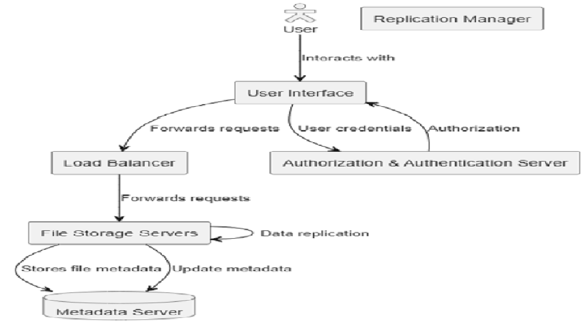
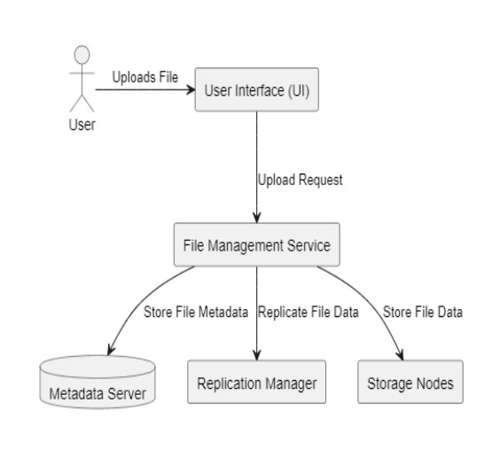
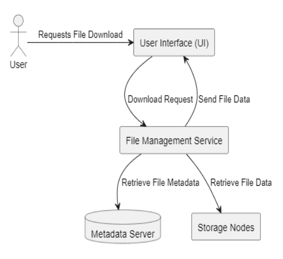
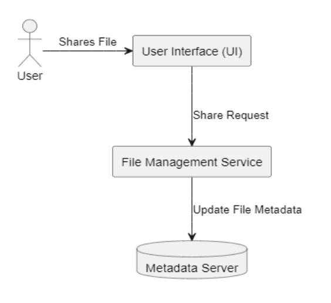

# **Task 1: HLD for a Distributed File Storage System**

## Main Components:

**User Interface (UI):** This component provides users with an interactive interface to access and manage files in the distributed storage system. It allows users to upload, download, and share files.

**File Management Service:** The File Management Service is the core module responsible for handling file-related operations. It interacts with the UI, Metadata Server, Authorization & Authentication Service, Replication Manager, and Storage Nodes to ensure seamless file storage and retrieval.

**Metadata Server:** The Metadata Server acts as the central repository for storing metadata related to files. It maintains information about file names, permissions, ownership details, timestamps, and storage locations.

**Authorization & Authentication Service:** The Authorization & Authentication Service ensures secure access to the file storage system. It verifies user credentials and authorizes users to perform specific file operations based on their permissions.

**Replication Manager:** The Replication Manager is responsible for managing file replication across multiple storage nodes. It ensures data redundancy and fault tolerance by replicating files across different nodes.

**Storage Nodes:** The Storage Nodes are distributed storage servers that store actual file data. They are responsible for storing and retrieving files requested by the File Management Service.

## Interactions between Components:

**File Upload:**
User initiates a file upload request through the UI.
The UI forwards the request to the File Management Service.
The File Management Service validates user credentials through the Authorization & Authentication Service.
If authorized, the File Management Service stores the file on an available Storage Node.
The File Management Service updates the file metadata in the Metadata Server. 
**File Download:**
User initiates a file download request through the UI.
The UI forwards the request to the File Management Service.
The File Management Service verifies user credentials and retrieves file metadata from the Metadata Server.
The File Management Service identifies the appropriate Storage Node containing the requested file data.
The File Management Service retrieves the file from the Storage Node and sends it back to the UI for download. 
**File Sharing:**
User initiates a file sharing request through the UI, specifying the recipients.
The UI forwards the request to the File Management Service.
The File Management Service validates the user's credentials and permissions.
If authorized, the File Management Service generates a shareable link with appropriate access permissions and sends it to the recipients.
Recipients can use the link to access the shared file. 
**Data Flow:**
User interacts with the User Interface to perform file-related operations.
The User Interface forwards requests to the File Management Service for processing.
The File Management Service interacts with the Metadata Server to store and retrieve file metadata.
The Authorization & Authentication Service verifies user credentials and permissions.
The File Management Service communicates with the Replication Manager to ensure data replication for fault tolerance.
File data flows between the File Management Service and the Storage Nodes for storage and retrieval. 

## DIAGRAM REPRESENTATION:

 

## Functions in FLOW 
**Uploading File:**
- User interacts with the User Interface to upload a file.
- User Interface forwards the upload request to the File Management Service.
- File Management Service communicates with the Metadata Server to store file metadata.
- File Management Service requests the Replication Manager to ensure data redundancy.
- Replication Manager coordinates with Storage Nodes to store file data across multiple node

**Downloading Files:**
- User requests to download a file via the User Interface.
- User Interface sends the download request to the File Management Service.
- File Management Service interacts with the Metadata Server to retrieve file metadata.
- File Management Service communicates with Storage Nodes to fetch file data segments.
- User Interface receives the file data from the File Management Service for download

**Sharing Files:**
- User interacts with the User Interface to share a file, specifying recipient details.
- User Interface forwards the sharing request to the File Management Service.
- File Management Service updates file metadata by communicating with the Metadata Server.
- Metadata Server adds recipient information and access permissions to the file's metadata.

